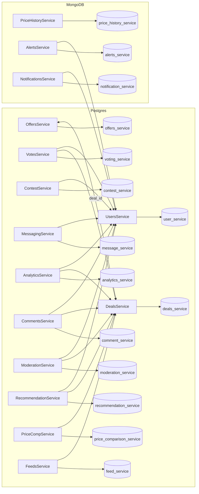

# DealsDatabase

Database schema definitions for a deal and offer aggregation platform.

## Structure

- `schemas/postgres/` – SQL files for Postgres microservice databases.
- `schemas/mongodb/` – JSON samples for MongoDB collections.

Each microservice owns its database and references others only by numeric or UUID identifiers.

## Microservices

1. **Deals Service (Postgres)** – deals, categories, stores, deal types and value added services.
2. **Offers Service (Postgres)** – offer definitions, requirements, benefits and linkage across deals.
3. **User Service (Postgres)** – customer profiles, devices, payment methods and memberships.
4. **Voting Service (Postgres)** – upvotes/downvotes with reaction emojis.
5. **Contest Service (Postgres)** – contest rules, prizes and participants.
6. **Messaging Service (Postgres)** – threads and messages between customers.
7. **Analytics Service (Postgres)** – per-deal and per-user metrics.
8. **Comment Service (Postgres)** – threaded deal discussions and reactions.
9. **Moderation Service (Postgres)** – reports, warnings and moderation logs.
10. **Recommendation Service (Postgres)** – saved deals, hides and view signals.
11. **Price Comparison Service (Postgres)** – product catalog and multi-store prices.
12. **Feeds Service (Postgres)** – curated surfaces like frontpage and trending lists.
13. **Price History Service (MongoDB)** – historic price documents per store & product.
14. **Alerts Service (MongoDB)** – user configured alerts for drops, keywords or stores.
15. **Notifications Service (MongoDB)** – multichannel notification payloads.

These schemas aim to cover a wide feature set for finding the best deals with connected offers.

## Service Interconnections

The platform is designed around two key entities – **deals** and **users**. Most services
record activity against a `deal_id` or `user_id` and do not enforce cross-database foreign
keys. Below is a high-level overview of how services relate:

- **Deals ↔ Offers** – `deal_offers` and `offer_deals` bridge tables associate offers with
  deals across databases.
- **Users ↔ Deals** – votes, comments, views, saves and hides all include both `user_id`
  and `deal_id` fields.
- **Users ↔ Messaging/Contests/Moderation** – threads, contest participation and
  moderation logs store `user_id` references.
- **Users ↔ Alerts/Notifications** – alert and notification documents embed `user_id` to
  deliver personalised updates.
- **Deals ↔ Feeds/Analytics/Price Comparison** – feed items, per-deal metrics and price
  records include `deal_id` links.

### Flow Diagram

## Detailed Tables

The following highlights how key tables connect across services:

- **deal_offers** (deals database) links deal records to offer IDs without a foreign key.
- **offer_deals** (offers database) performs the inverse mapping from offers to deals.
- **votes**, **comment_votes** and **comment_reactions** store both `deal_id` and
  `user_id` to attribute community feedback.
- **saved_deals**, **deal_hides** and **deal_views** capture user interactions for
  recommendations.
- **feed_items** references deals to build curated lists.
- **alerts** and **notifications** documents reference `user_id` in MongoDB collections.

## Running Tests

This repository only contains schema files; no automated tests are provided yet.
